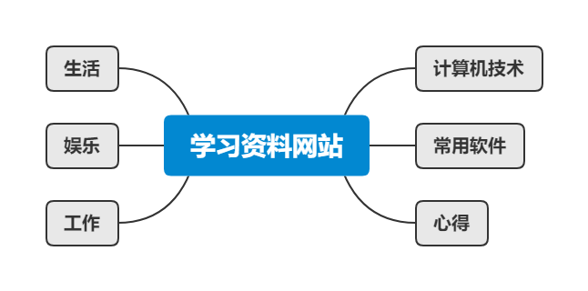

  <h2 align="center">
        薯条蘸酱才好吃的学习资料网站
  </h2>

<!-- 

   

 -->

  
   

  
  
  <!--  -->

---

# **网站概述**

---

> - **梳理知识库**
> - **收藏各类教程文档**
> - **撰写心得与文章**
> 
> 方便查阅与总结

---

# **本站内容思维导图**

---

---

